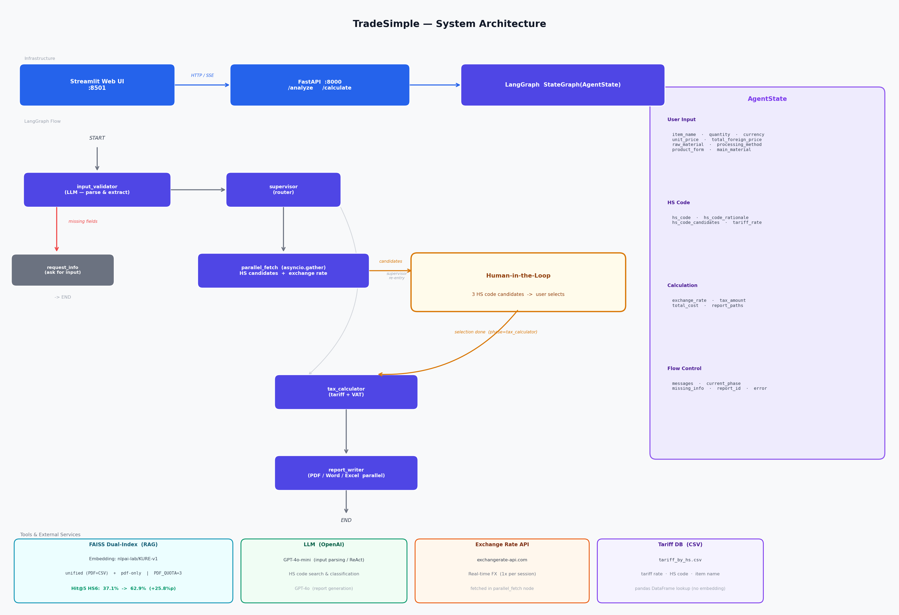

# TradeSimple — 수입업무 간편화 AI 에이전트

> HS 코드 분류 및 관세 비용 계산 자동화 | K Intelligence 해커톤 2025 출품작

---

## 배경

**2023년 로이터스 보고서**에 따르면 크로스보더 이커머스 기업의 **94%**가 서류 오류로 물류 지연을 경험했으며,
**41%는 HS 코드 입력**을 가장 어려운 업무로 꼽았다.

HS 코드는 **40,000개 이상**의 코드가 존재하고, 국가마다 상이하며 수 년 주기로 개정된다.
수입 비용 계산은 여기서 끝나지 않는다 — 실시간 환율 조회, FTA 협정세율 확인, 부가세 계산까지
모두 숙련된 지식과 시간이 필요하다.

**TradeSimple**은 이 전 과정을 AI 에이전트로 자동화하되, 분류 오류가 치명적인 HS 코드 선택 단계에서는
**사람의 최종 판단을 반드시 거치는** Human-in-the-Loop 구조로 설계했다.

---

## 아키텍처



---

## 입출력 예시

**입력**
```
미국에서 스마트워치 100개를 개당 300달러에 수입하려고 합니다.
```

**출력**
- HS 코드 후보 3개 제시 → **사용자가 직접 선택**
- 적용 관세율 자동 조회 (예: 한-미 FTA 0%)
- 총 예상 비용 계산 (환율 자동 반영)
- PDF / Word / Excel 보고서 즉시 생성

---

## 핵심 특징

### 1. Human-in-the-Loop — HS 코드 선택

HS 코드는 수입 비용 전체에 직접 영향을 주는 핵심 정보다.
AI가 단일 결과를 강제하는 대신, **후보 3개를 제시하고 사용자가 검증·선택**한다.

```
① 사용자 입력  →  ② HS 코드 후보 3개 + 분류 근거 제시
                        ↓  사용자 선택
                   ③ 세금 계산  →  ④ 보고서 생성 (PDF/Word/Excel)
```

| 완전 자동화 | Human-in-the-Loop |
|------------|-------------------|
| AI가 단일 결과 강제 | AI가 후보 3개 제시, 사용자가 선택 |
| 오류 발생 시 전체 결과가 틀림 | 사용자 검증으로 오류 방지 |
| 분류 근거 불투명 | 각 후보별 관세청 DB 원문 인용 |

### 2. LangGraph 멀티 에이전트 — Supervisor 패턴

5개 노드가 **StateGraph**로 연결되어 순차·병렬 처리를 조율한다.

| 노드 | 역할 |
|------|------|
| `input_validator` | LLM으로 메시지에서 물품명·수량·통화 등 추출 |
| `supervisor` | 현재 phase에 따라 다음 노드 결정 |
| `parallel_fetch` | HS 후보 검색 + 환율 조회를 **asyncio.gather**로 동시 실행 |
| `tax_calculator` | 관세 + 부가세 계산 (환율 재조회 없이 상태 재사용) |
| `report_writer` | PDF / Word / Excel을 **asyncio.gather**로 동시 생성 |

### 3. FAISS 듀얼 인덱스 RAG

RAG 정확도 실험(37개 테스트 케이스, Hit@5 HS6 기준)을 통해 최적 조합을 도출했다.

| 구성 요소 | 선택값 | 이유 |
|-----------|--------|------|
| 임베딩 모델 | `nlpai-lab/KURE-v1` | 한국어 특화, MRR·Hit@1 균형 최적 |
| 청킹 전략 | RecursiveCharacter 2000자 | large 청킹이 맥락 보존에 유리 |
| 인덱스 구조 | 듀얼 인덱스 (통합 + PDF-only) | CSV 지배 현상 해소 |
| PDF 쿼터 | 3 (CSV 쿼터=2) | Hit@5 최적 균형점 |

```
Hit@5 HS6:  37.1% (baseline)  →  62.9% (최종)  +25.8%p  ×1.7
Hit@5 HS4:  88.6%   MRR: 0.3795
```

### 4. API-First 아키텍처

```
[Streamlit :8501]  ──HTTP/SSE──>  [FastAPI :8000]  ──>  [LangGraph Agents]
```

UI와 에이전트 로직이 완전히 분리되어 있어, 동일한 API 엔드포인트로
웹 UI·모바일·서드파티 연동이 모두 가능하다.

---

## 기술 스택

| 분류 | 기술 |
|------|------|
| **에이전트 오케스트레이션** | LangGraph StateGraph, Supervisor Pattern |
| **LLM** | OpenAI GPT-4o-mini (입력 파싱·ReAct), GPT-4o (보고서) |
| **RAG** | FAISS, KURE-v1 임베딩, 듀얼 인덱스 balanced search |
| **API 서버** | FastAPI, SSE 스트리밍 |
| **Web UI** | Streamlit |
| **보고서 생성** | reportlab (PDF), python-docx (Word), pandas (Excel) |
| **배포** | Docker Compose (API + Web UI 분리) |

---

## 설치 및 실행

### 사전 요구사항

- Python 3.10+
- OpenAI API 키

### 1. 클론 및 의존성 설치

```bash
git clone https://github.com/10mm-notebook/TradeSimple.git
cd TradeSimple
pip install -r requirements.txt
```

### 2. 환경 변수

```bash
cp .env.example .env
# .env 에 OPENAI_API_KEY 입력
```

### 3. FAISS 인덱스 빌드 (최초 1회)

```bash
python scripts/run_preprocessing.py
```

### 4. 실행

```bash
# API 서버 (터미널 1)
python -m api.server          # http://localhost:8000

# Web UI (터미널 2)
streamlit run app/main.py     # http://localhost:8501
```

### Docker

```bash
docker-compose up -d --build
# Web UI: http://localhost:8501
# API:    http://localhost:8000/docs
```

---

## API

### 2단계 HITL 플로우

| Method | Endpoint | 설명 |
|--------|----------|------|
| `POST` | `/api/v1/analyze` | 1단계: 입력 분석 + HS 코드 후보 3개 반환 |
| `POST` | `/api/v1/analyze/stream` | 위와 동일, SSE 스트리밍 |
| `POST` | `/api/v1/calculate` | 2단계: 선택된 HS 코드로 비용 계산 + 보고서 생성 |
| `POST` | `/api/v1/calculate/stream` | 위와 동일, SSE 스트리밍 |

#### 1단계: 분석

```bash
curl -X POST http://localhost:8000/api/v1/analyze \
  -H "Content-Type: application/json" \
  -d '{"message": "미국에서 스마트워치 100개를 개당 300달러에 수입"}'
```

```json
{
  "session_id": "abc123",
  "phase": "hs_code_selection",
  "hs_code_candidates": [
    {"hs_code": "8517.62-9090", "description": "무선통신기기", "rationale": "..."},
    {"hs_code": "9102.12-0000", "description": "전자식 손목시계", "rationale": "..."},
    {"hs_code": "8471.30-0000", "description": "휴대용 자동자료처리기계", "rationale": "..."}
  ],
  "exchange_rate": 1380.5
}
```

#### 2단계: 계산

```bash
curl -X POST http://localhost:8000/api/v1/calculate \
  -H "Content-Type: application/json" \
  -d '{"session_id": "abc123", "selected_hs_code": "8517.62-9090"}'
```

> `calculate`는 `analyze`에서 저장된 세션 상태를 재사용합니다. `session_id`와 `selected_hs_code`만 전달하면 됩니다.

---

## RAG 정확도 실험 (`eval/`)

LLM 호출 없이 순수 벡터 검색 정확도만 측정하는 평가 파이프라인을 직접 구축했다.

**실험 설계**: 한 번에 하나의 변수만 바꾸는 단계별 ablation

| Phase | 변경 변수 | 결과 |
|-------|-----------|------|
| 베이스라인 | ko-sroberta / 1000자 / 단일 인덱스 | Hit@5 37.1% |
| Phase 1 | 청킹 전략 탐색 (7가지) | **large 2000자** → 42.9% (+5.8%p) |
| Phase 2 | 임베딩 모델 탐색 (CPU 4개 + GPU 5개) | **KURE-v1** → 45.7% (+8.6%p) |
| Phase 3 | 최적 청킹 × 최적 임베딩 조합 | large × KURE-v1 → 54.3% (시너지) |
| Phase 4 | BM25 hybrid / CrossEncoder rerank | Hit@5 변화 없음 → 방향 전환 |
| Phase 5 | 듀얼 인덱스 PDF 쿼터 조정 | **PDF=3** → **62.9%** (+8.6%p) ★ |

> 세부 실험 과정 및 결과: [`eval/README.md`](eval/README.md)

---

## 프로젝트 구조

```
TradeSimple/
├── api/                         # FastAPI 서버
│   ├── server.py                # 엔드포인트 + SSE 스트리밍
│   └── schemas.py               # Pydantic 스키마
│
├── app/                         # 에이전트 코어
│   ├── graph.py                 # LangGraph StateGraph (5 노드)
│   ├── state.py                 # AgentState TypedDict
│   ├── models.py                # LLM / 임베딩 모델 팩토리
│   ├── tools.py                 # 6개 도구 (RAG·관세DB·환율·보고서)
│   ├── main.py                  # Streamlit Web UI
│   └── agents/
│       ├── hs_code_finder.py    # ReAct 에이전트 (후보 3개 + 단독 검색)
│       ├── tax_calculator.py    # 관세·부가세 계산
│       └── report_writer.py     # PDF/Word/Excel 병렬 생성
│
├── eval/                        # RAG 정확도 평가 파이프라인
│   ├── README.md                # 실험 상세 (Phase 1-5 결과 포함)
│   ├── chunking_strategies.py   # 청킹 전략 레지스트리 (7가지)
│   ├── embedding_registry.py    # 임베딩 모델 레지스트리 (9가지)
│   ├── preprocess_experiment.py # 조합별 FAISS 인덱스 빌더
│   ├── evaluate_retrieval.py    # 검색 정확도 평가 실행기
│   └── run_experiments.py       # 일괄 실험 + 비교 테이블
│
├── scripts/
│   ├── run_preprocessing.py     # Production FAISS 인덱스 생성
│   └── run_gpu_experiments.py   # GPU 임베딩 실험 자동화
│
├── data/
│   ├── hsk_guide.pdf            # HSK 품명규격 가이드 (RAG 소스)
│   └── tariff_by_hs.csv         # 관세율 DB (HS 코드 → 세율)
│
├── vector_store/                # FAISS 인덱스 (git 제외)
├── docker-compose.yml
├── Dockerfile                   # API 서버
├── Dockerfile.web               # Web UI (경량)
└── requirements.txt
```

---

## 환경 변수

| 변수명 | 필수 | 설명 |
|--------|------|------|
| `OPENAI_API_KEY` | ✅ | OpenAI API 키 |
| `API_BASE_URL` | ❌ | API 서버 URL (기본: `http://localhost:8000`) |
| `LANGCHAIN_API_KEY` | ❌ | LangSmith 트레이싱 |
| `LANGCHAIN_TRACING_V2` | ❌ | `true`로 설정 시 LangSmith 활성화 |

---

## 라이선스

MIT License
